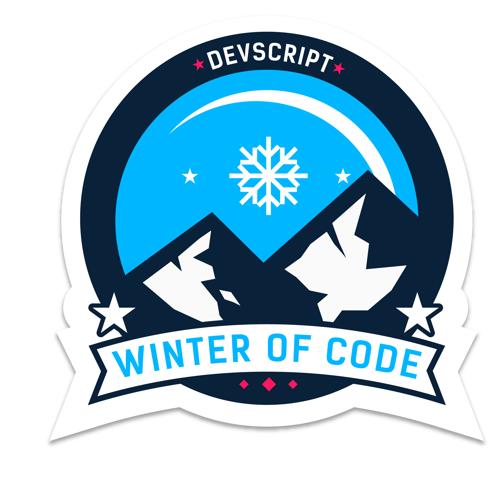

[comment]: <> (![Awesome Portfolio Website]&#40;./readme_assets/banner_apw.png&#41;)

[comment]: <> (
)

[comment]: <> ()

[comment]: <> ()

[comment]: <> ()

[comment]: <> ()

[comment]: <> ()

[comment]: <> ()

[comment]: <> ()

[comment]: <> ()

[comment]: <> ()

[comment]: <> ()

[comment]: <> ()

[comment]: <> ()

[comment]: <> (
)

[comment]: <> (A community maintained open source project aimed at making personal portfolio for researchers, developers and analysts simple, fast and less cumbersome. We make sure you have a full-fledged website to showcase your work while you can spend time on your learning and innovative endeavours.)

[comment]: <> (## A sneak peek into what we have here🙈 :)

[comment]: <> (### Home Page:)

[comment]: <> (

)

[comment]: <> (### Experience Page:)

[comment]: <> (

)

[comment]: <> (### Project Page:)

[comment]: <> (

)

[comment]: <> (### Research Page:)

[comment]: <> (

)

[comment]: <> (### Education Page:)

[comment]: <> (

)

[comment]: <> (## How to use this?🛠)

[comment]: <> ([Check out our awesome Documentation]&#40;https://smaranjitghose.github.io/awesome-portfolio-websites/&#41;)

[comment]: <> (## Contribution Guidelines🏗)

[comment]: <> (Are we missing any of your favorite features, which you think you can add to it❓ We invite you to contribute to this project and improve it further.)

[comment]: <> (Click on the image below to set up and contribute to the project or [Click here]&#40;https://github.com/smaranjitghose/awesome-portfolio-websites/blob/master/CONTRIBUTING.md&#41;)

[comment]: <> (<a href = "https://github.com/smaranjitghose/awesome-portfolio-websites/blob/master/CONTRIBUTING.md">)

[comment]: <> (</a>)

[comment]: <> (## Project Maintainers👨🏫:)

[comment]: <> (|  |  | )

[comment]: <> (| :----------------------------------------------------------: | :----------------------------------------------------------: | )

[comment]: <> (|     [Smaranjit Ghose]&#40;https://github.com/smaranjitghose&#41; |    [Anush Bhatia]&#40;https://github.com/anushbhatia&#41;                       )

[comment]: <> (## Our valuable Contributors👩‍💻👨‍💻 :)

[comment]: <> (<a href="https://github.com/smaranjitghose/awesome-portfolio-websites/graphs/contributors">)

[comment]: <> (  )

[comment]: <> (</a>)

[comment]: <> (## Open Source Programs we have been a part of:)

[comment]: <> (
)

[comment]: <> ()

[comment]: <> ()

[comment]: <> ()

[comment]: <> ()

[comment]: <> ()

[comment]: <> ()

[comment]: <> ()

[comment]: <> ()

[comment]: <> ()

[comment]: <> (
)
